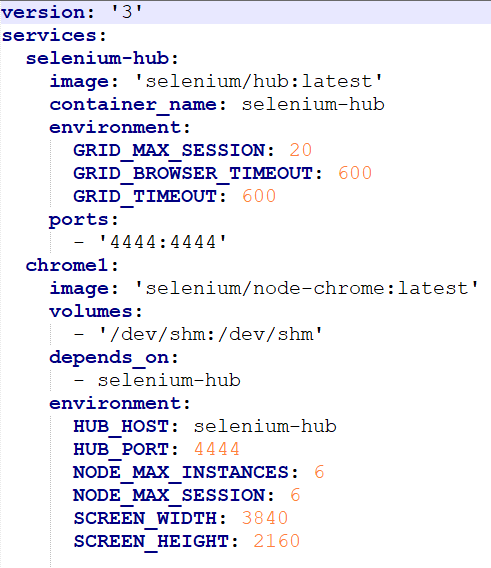
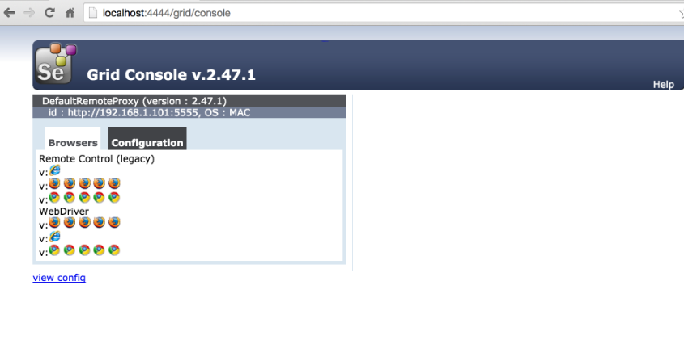
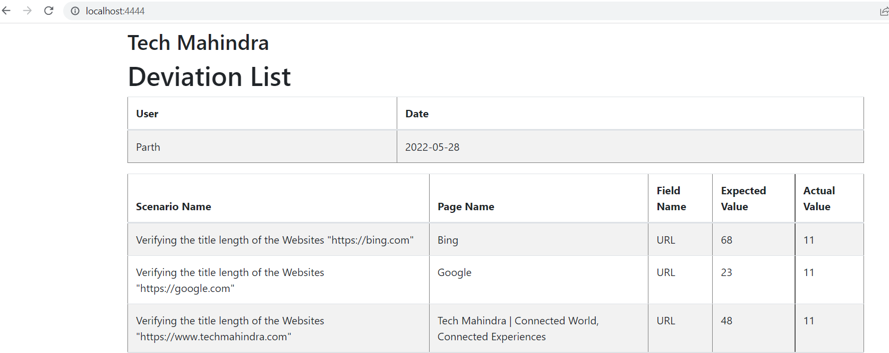

# Automated Execution Reprot
=================================
# setting up docker
---------------------------------
# EC2 1 (Jenkins, Java V11.0.xx, maven v3.16 or letter)
-------------------------------------------------------
job1 (one time runnable)
------------------------
`docker system prune`
`docker-compose up -d --scale chrome1 10`

if need to restart docker
----------------------------------

`sudo systemctl daemon-reload`
`sudo systemctl restart docker`

# EC2 2 (cucumber cli based parallel execution, where minimum 6 scenarios can be run in parallel)
*****************************************************************************************
`cd autofw\TemenosT24\TemenosT24_Web`

`code(mvn compile exec:java -Dexec.args="./src/main/java/com/temenos/FeatureFile/ --glue com.temenos --plugin pretty --plugin com.codeOfCritical.CucumberExtentReport.adapter.ExtentCucumberAdapter: --tags '@t1' --threads 4" )`
  
copy the JSON file from the Framework Jenkins(AWS EC2 linux server edition of 2 )
---------------------------------------------------------------------------------
`cp ../deviation.json autofw\T .\emenosT24\TemenosT24_Web\test-outout\Custom-Report-HealthCheck\`

# Start TestReport Spring boot application
-------------------------------------------
`cd /autofw/TestReport_Web`

`mvnspring-boot:run`
#### OR #####
`mvn compile test -Dtest=SpringBootWebApplication`

!! development of Report is in progress !!